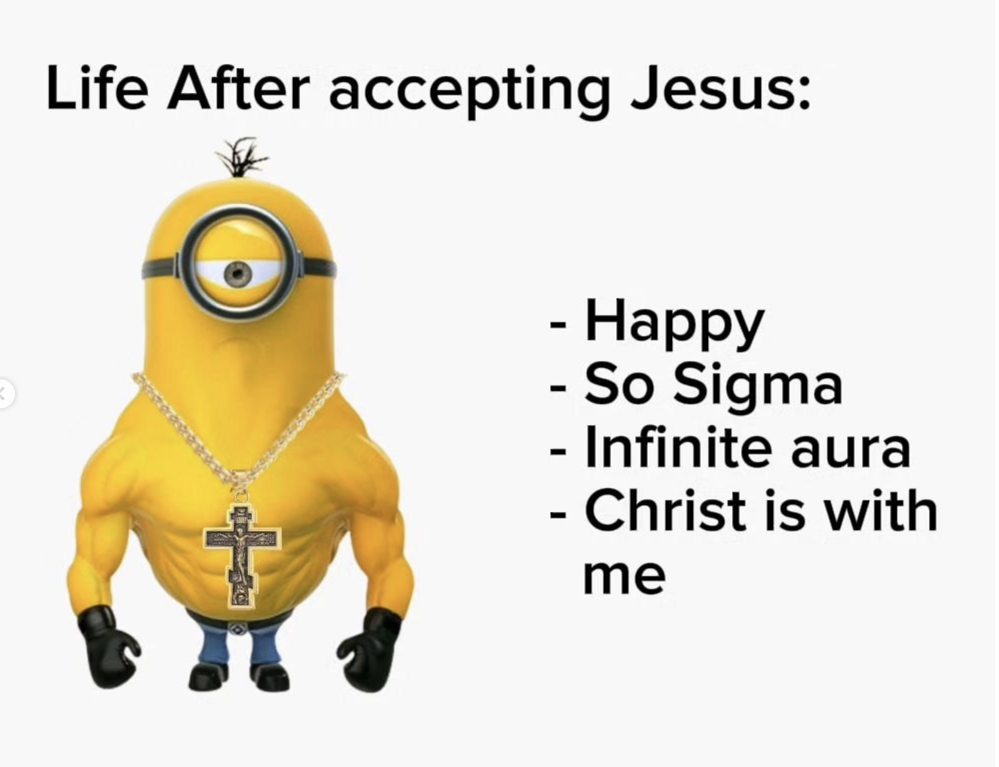

# My Testimony - Elijah Muraoka

## My background and early understanding of Christ.

-   I grew up in a Christian household and went to an Episcopal school, but somehow never truly learned what it meant to follow Jesus until much later in life.
-   Some could have said it was my parents’ fault for not understanding or thoroughly explaining Christ to me.
-   Others could have said it was the fault of my school whose entire purpose was education both academically and Biblically.
-   However, in many ways I believe it was my own ignorance that led me away from eternal knowledge and a life led by Jesus Christ.
-   Throughout most of my life, I had always believed in a supernatural creator. But honestly, I only believed this because to me, it would be naive to think that this world is the extent of everything we could possibly know.
-   In many ways, I had a poor relationship with Christ. When my mother could not think of anything to say during an argument between me and her, she would often frame God as this supernatural being meant to punish and condemn me for never agreeing with her. This left a bad taste in my mouth for many years.
-   Additionally, growing up I had often practiced prayer, but the way it was practiced by those around me seemed more transactional than relational. Everyday I would show gratitude in my prayer which I have always believed to be extremely important, but immediately after I would just ask for whatever I needed for myself or others whether it was health, wealth, happiness, etc.
-   And in no way am I saying that asking God during times of need is a bad thing. But it was only until nearly a decade later when I realized that God wasn't some magical genie or like Santa Claus, but rather a personal father who wants to have a relationship with us -- not only looking to him when we need something.

## How I came to know Christ.

-   In reality, my story wasn't any miraculous, life-altering event, waking up one day all of a sudden and believing.
-   I had rejected Christ time and time again -- initially just by skipping Church for sports matches, but over time I chose to ignore him in all parts of my life as it seemed more like an inconvenience to have this supernatural party-pooper watching over me all the time.
-   But hypocritically, a large part of me still wanted to be seen as this "good" Christian boy so I played the part without actually knowing anything about the role.
-   Simultaneously, I was living within sin without any care in the world whether that was jealousy of others around me, leaning into lust rather than love, or pridefully maintaining my false self-image. That was my life and I didn't know any better.

-   I am now going into my senior year at Northeastern University and have been involved with Reclaimer College Church since my freshmen year. Looking back on it, it's been almost three years of questioning, learning, and growing.
-   As I mentioned earlier, my faith really wasn't any miraculous supernatural encounter that changed me forever overnight, but rather it is the result of my enduring curiosity and the fruits of many beautiful relationships.
-   I had many questions and doubts about God & Jesus:
    -   Epicurean Paradox
    -   Do people who were never given the change to know Jesus go to Hell?
    -   There are so many other religions, how can I trust this one is absolute over the others?
-   I thought I wasn't fit to be called a believer because of all these doubts. On my 20th birthday, one of my best friends Andrew Dawson, gave me a book called, "101 Secrets for your Twenties"
    -   Secret #26 changed my perspective - “Our imperfections, doubts, and questions about faith don’t make us unfaithful freaks — they make us human.”
-   Slowly but surely, I began to build my understanding of Christ searching relentlessly for answers to my questions.
    -   Last year, Linda Song, who knew of my quest for knowledge, lended me a book, "Give Me an Answer" by Cliff Knechtle.
    -   Last summer, I read that book nearly everyday looking into every question in-depth.
-   However, as I researched more, I actually found myself asking more questions. I quickly realized that I will never absolutely know everything about Christ and that is the whole point of faith; it is taking that extra step beyond our fundamental understanding.
    -   Thomas, one of Jesus' disciples, refuses to believe in Jesus' resurrection unless he sees him in the flesh and feels his pierced body.
    -   "Have you believed because you have seen me? Blessed are those who have not seen and yet have believed."
    -   None of us have had the opportunity to see the miracles of Jesus in the flesh, but Jesus explains that is what makes our faith so special.

## How did he change my life? + Personal Prayer

-   In reality, my life didn't start changing once I had fully believed in Christ. It started changing once I finally began to understand and trust Him.
-   I have opened my eyes to so many broken areas of my life and started addressing each of them one by one.
-   I am nowhere near perfect.
-   I am still fighting against temptation and evil everyday -- pride, lust, anger, laziness, etc.
-   I recognize that I am a sinner and deserve death.

-   But more importantly, I recognize that Jesus Christ has paid this price for me on the cross.
-   And there is no amount of "good deeds" which I could do in this life to earn a ticket into heaven, but only through my decision to follow Christ and His boundless grace by which I am saved.
-   I am a child of God and he loves me unconditionally. As such, it is my duty to love God, and love others so that they too may receive this gift of salvation.

 

> Dear Heavenly Father,
>
> I want to thank you for this beautiful day that I can share with many of my family and friends. Thank you for accepting me into your kingdom and loving me, knowing well how broken I am. I am sorry to have rejected you time and time again in the past, living as a complete hypocrite, even when you would have welcomed me with open arms. I hope I can encourage others so that they may experience the same kind of unconditional love you have shown me. Lord, please imbue me with your spirit and use me as your vessel to display your righteousness, glory, and spread your eternal word. And if I am ever on a false path, I pray that you correct me so that I know better. When I am lost, I will confide in you and I pray that you will provide me with your wisdom so that I may understand and move forward with you.
> Thank you again for allowing me to share such a special moment with my brothers Mike and Aden such that we will follow and honor you in all the rest of our days on this earth.
>
> In Jesus' name we pray,
>
> Amen.

To close, I want to thank several individuals who have profoundly influenced my relationship with Christ.

-   My parents
-   Sam and Linda Song, David Lee, and Wilson Bui + the rest of the Reclaimer Community
-   Andrew Dawson
-   Logan Horita
-   Michael Long
-   Aden Lu

---

    

